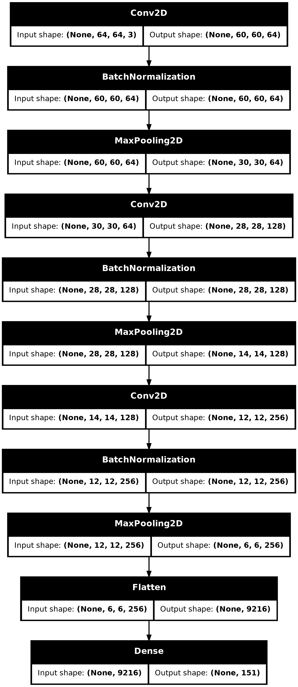
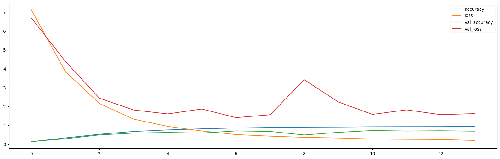

# Smart Pokedex 


**Smart Pokedex** is a Python-based tool designed for classifying Pokémon images using machine learning models built with TensorFlow. The tool provides functionality to load a pre-trained model, process Pokémon image data, and make predictions on unseen images. It supports model training, evaluation, and saving, as well as flexible handling of Pokémon image datasets.

## Features

- **Pokémon Image Classification**: Classifies images of Pokémon into specific species based on a convolutional neural network (CNN).
- **Model Training and Evaluation**: Train models using custom datasets and evaluate model performance using accuracy metrics.
- **Model Persistence**: Save trained models and their associated metadata to disk and reload them when needed.
- **Data Augmentation**: Support for image data augmentation (e.g., shear, zoom, horizontal flip) to improve model generalization during training.
- **Command-Line Interface (CLI)**: Provides a simple CLI for interacting with the model, including running classification predictions on images.

## Model Architecture

The following diagram illustrates the architecture of the convolutional neural network (CNN) used for Pokémon image classification:



The model consists of several convolutional layers for feature extraction, followed by max-pooling layers for downsampling. The fully connected layer at the end uses a softmax activation function to classify Pokémon images into different species.

### Training Progress

The following plot shows the training and validation accuracy over epochs:



As seen in the plot, the model improves its accuracy during training and eventually stabilizes. The validation accuracy demonstrates the model's generalization capability on unseen data. Early stopping and learning rate adjustments helped achieve better performance without overfitting.


## 🚀 Requirements

Before you begin, ensure you have the following tools installed:

- [Docker](https://www.docker.com/get-started) 
- [Visual Studio Code](https://code.visualstudio.com/) 
- [Remote - Containers extension](https://marketplace.visualstudio.com/items?itemName=ms-vscode-remote.remote-containers) 
- [Poetry](https://python-poetry.org/docs/#installation)  (if not using Dev Container)

## 🛠 Setting Up Environment Using Dev Container

1. **Clone the repository**

   First, clone the repository to your local machine:

   ```bash
   git clone https://https://github.com/kruksik-dev/smart_pokedex
   cd smart_pokedex
   ```

2. **Start the Dev Container**

   Open the project folder in Visual Studio Code. When you open the folder, VSCode should automatically suggest reopening it in a Dev Container. You can also do this manually:

   - Open the command palette (`Ctrl + Shift + P`).
   - Select `Remote-Containers: Reopen Folder in Container`.

   VSCode will download the necessary Docker image and create a container. Once completed, you will have access to a fully configured environment.

3. **Install dependencies**

   If you have a `poetry.lock` file in your project, all dependencies will be automatically installed when the container is opened. If you want to install new dependencies, use:

   ```bash
   poetry add <package_name>
   ```

## 🛠 Setting Up Environment Using Poetry (Without Dev Container)

If you prefer not to use a Dev Container, you can set up your environment locally using Poetry:

1. **Install Poetry**

   If you haven't installed Poetry yet, you can do so with the following command:

   ```bash
   curl -sSL https://install.python-poetry.org | python3 -
   ```

   Make sure to add `~/.local/bin` to your `$PATH`.

2. **Clone the repository**

   Copy the repository to your local machine:

   ```bash
   git clone https://https://github.com/kruksik-dev/smart_pokedex
   cd smart_pokedex
   ```

3. **Install dependencies**

   Install all project dependencies:

   ```bash
   poetry install
   ```

4. **Running the project**

   To run the project, you can use:

   ```bash
   poetry run python <filename.py>
   ```


## Usage

### Run Classification with CLI

To classify a Pokémon image using the command-line interface (CLI), you can use the following command:

```bash
smart-pokedex --image_path /path/to/pokemon_image.jpg
```

Where `/path/to/pokemon_image.jpg` is the path to the Pokémon image you want to classify. The command will output the predicted Pokémon species and the confidence level of the prediction.

### Example

```bash
smart-pokedex --image_path /path/to/pikachu.jpg
```


## 🐞 Reporting Issues

If you encounter any problems, please open an issue in the repository or contact the project author.

## 🐜 Contributing

If you want to contribute to **Smart Pokedex**, feel free to fork the repository, make your changes, and submit a pull request.


## 📄 License

This project is licensed under the MIT License. See the `LICENSE` file for details.
